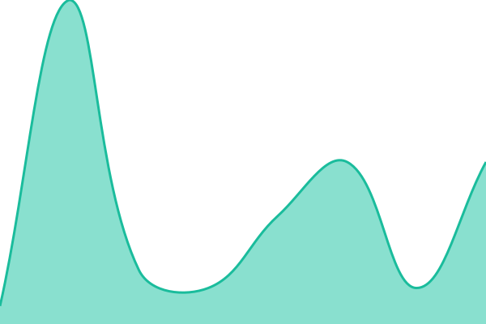

# [📈 Live Status](https://lawlietr.github.io/upptime.doh.avpclub.uk): <!--live status--> **🟩 All systems operational**

This repository contains the open-source uptime monitor and status page for [Upptime](https://upptime.js.org), powered by [Upptime](https://github.com/upptime/upptime).

With [Upptime](https://upptime.js.org), you can get your own unlimited and free uptime monitor and status page, powered entirely by a GitHub repository. We use [Issues](https://github.com/upptime/upptime/issues) as incident reports, [Actions](https://github.com/Lawlietr/upptime.doh.avpclub.uk/actions) as uptime monitors, and [Pages](https://demo.upptime.js.org) for the status page.

<!--start: status pages-->
<!-- This summary is generated by Upptime (https://github.com/upptime/upptime) -->
<!-- Do not edit this manually, your changes will be overwritten -->
<!-- prettier-ignore -->
| URL | Status | History | Response Time | Uptime |
| --- | ------ | ------- | ------------- | ------ |
|  AGH-01-US | 🟩 Up | [agh-01-us.yml](https://github.com/Lawlietr/upptime.doh.avpclub.uk/commits/HEAD/history/agh-01-us.yml) | 

 833ms
     
 | 

<a href="https://Lawlietr.github.io/upptime.doh.avpclub.uk/history/agh-01-us">100.00%</a>
    

|  AGH-02-JP | 🟩 Up | [agh-02-jp.yml](https://github.com/Lawlietr/upptime.doh.avpclub.uk/commits/HEAD/history/agh-02-jp.yml) | 

 458ms
     
 | 

<a href="https://Lawlietr.github.io/upptime.doh.avpclub.uk/history/agh-02-jp">98.01%</a>
    

|  AGH-03-TW | 🟩 Up | [agh-03-tw.yml](https://github.com/Lawlietr/upptime.doh.avpclub.uk/commits/HEAD/history/agh-03-tw.yml) | 

 681ms
     
 | 

<a href="https://Lawlietr.github.io/upptime.doh.avpclub.uk/history/agh-03-tw">100.00%</a>
    

|  VW-01 | 🟩 Up | [vw-01.yml](https://github.com/Lawlietr/upptime.doh.avpclub.uk/commits/HEAD/history/vw-01.yml) | 

 834ms
     
 | 

<a href="https://Lawlietr.github.io/upptime.doh.avpclub.uk/history/vw-01">100.00%</a>
    

|  Mail-01 | 🟩 Up | [mail-01.yml](https://github.com/Lawlietr/upptime.doh.avpclub.uk/commits/HEAD/history/mail-01.yml) | 

 548ms
     
 | 

<a href="https://Lawlietr.github.io/upptime.doh.avpclub.uk/history/mail-01">100.00%</a>
    

|  [Google DNS1](8.8.8.8) | 🟩 Up | [google-dns-1.yml](https://github.com/Lawlietr/upptime.doh.avpclub.uk/commits/HEAD/history/google-dns-1.yml) | 

 4ms
     
 | 

<a href="https://Lawlietr.github.io/upptime.doh.avpclub.uk/history/google-dns-1">100.00%</a>
    

|  [Cloudflare DNS1](1.1.1.1) | 🟩 Up | [cloudflare-dns-1.yml](https://github.com/Lawlietr/upptime.doh.avpclub.uk/commits/HEAD/history/cloudflare-dns-1.yml) | 

 7ms
     
 | 

<a href="https://Lawlietr.github.io/upptime.doh.avpclub.uk/history/cloudflare-dns-1">100.00%</a>
    

<!--end: status pages-->

[**Visit our status website →**](https://lawlietr.github.io/upptime.doh.avpclub.uk)

## 📄 License

- Powered by: [Upptime](https://lawlietr.github.io/upptime.doh.avpclub.uk)
- Code: [MIT](./LICENSE) © [Anand Chowdhary](https://anandchowdhary.com), supported by [Pabio](https://pabio.com)
- Data in the `./history` directory: [Open Database License](https://opendatacommons.org/licenses/odbl/1-0/)
